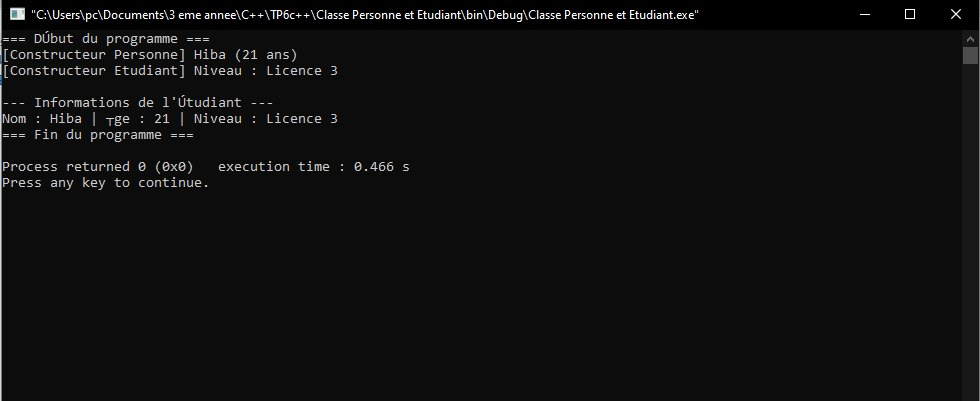
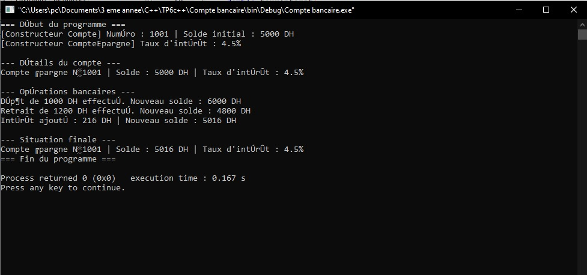
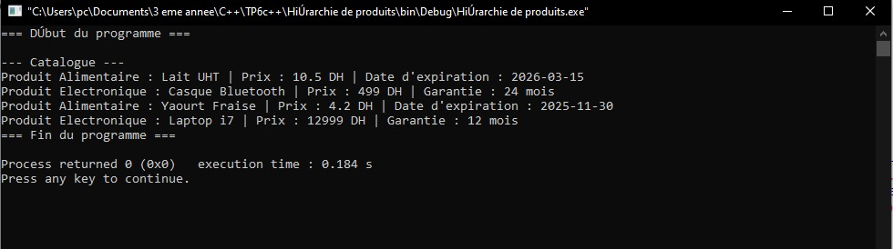
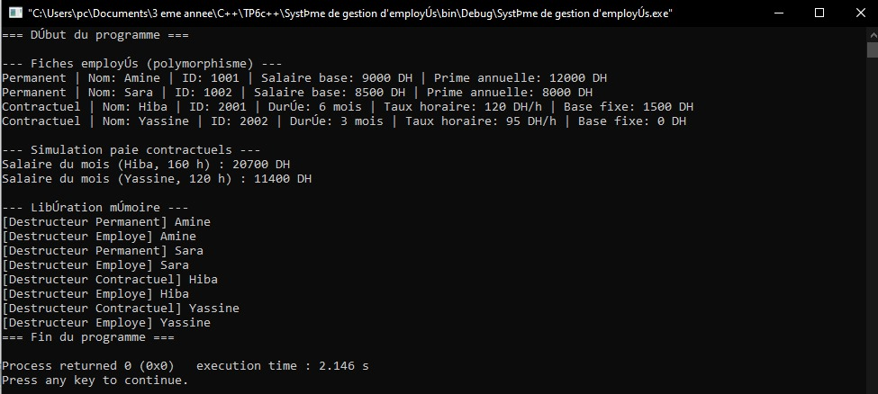

#  TP6 – Héritage simple
### Cours : Programmation Orientée Objet (C++)

---

##  Objectif global
Découvrir et appliquer la notion **d’héritage simple** en C++ à travers plusieurs cas pratiques :
- Réutiliser les attributs et méthodes d’une classe de base.
- Spécialiser des classes dérivées.
- Mettre en œuvre le **polymorphisme** et les **méthodes virtuelles**.
- Gérer correctement la mémoire via des destructeurs virtuels.

## Exercice 1 : Classe Personne et Étudiant

---

##  Objectif
Découvrir le **principe de l’héritage simple** en C++.  
Permettre à une classe dérivée (`Etudiant`) de réutiliser les attributs et méthodes de la classe de base (`Personne`).

---

##  Spécifications techniques

### Classe : `Personne`
| Attribut | Type | Description |
|-----------|-------|-------------|
| `nom` | `string` | Nom de la personne |
| `age` | `int` | Âge de la personne |

**Méthode :**
- `void afficher()` → affiche les informations de la personne.

---

### Classe dérivée : `Etudiant`
| Attribut | Type | Description |
|-----------|-------|-------------|
| `niveau` | `string` | Niveau d’étude (ex : Licence, Master, etc.) |

**Méthodes :**
- Constructeur qui appelle celui de `Personne`.
- `void afficher()` → redéfinit l’affichage pour inclure le niveau.

Résultat visuel

  
<em>Figure 1</em>
 

---
##  Exercice 2 : Compte bancaire et Compte épargne

---

##  Objectif
Illustrer l’**héritage public** et l’**appel du constructeur de la classe de base**.  
Créer une classe dérivée spécialisée (`CompteEpargne`) à partir d’une classe générique (`Compte`).

---

##  Spécifications techniques

### Classe : `Compte`
| Attribut | Type | Description |
|-----------|-------|-------------|
| `numero` | `int` | Numéro du compte |
| `solde` | `float` | Solde du compte |

**Méthodes :**
- `void deposer(float montant)` → ajoute au solde.
- `void retirer(float montant)` → retire du solde si possible.
- `void afficher()` → affiche les informations du compte.

---

### Classe dérivée : `CompteEpargne`
| Attribut | Type | Description |
|-----------|-------|-------------|
| `tauxInteret` | `float` | Taux d’intérêt (%) |

**Méthode :**
- `float calculerInteret()` → renvoie le montant des intérêts générés.

Résultat visuel

  
<em>Figure 2</em>
 

---
##  Exercice 3 : Hiérarchie de produits

---

##  Objectif
Illustrer la **redéfinition de méthodes virtuelles** et la **spécialisation par héritage**.  
Construire un petit système de gestion de produits.

---

##  Spécifications techniques

### Classe : `Produit`
| Attribut | Type | Description |
|-----------|-------|-------------|
| `nom` | `string` | Nom du produit |
| `prix` | `float` | Prix du produit |

**Méthode :**
- `virtual void afficherInfos()` → méthode virtuelle à redéfinir dans les classes dérivées.

---

### Classe dérivée : `ProduitAlimentaire`
| Attribut | Type | Description |
|-----------|-------|-------------|
| `dateExpiration` | `string` | Date limite de consommation |

**Méthode :**
- `void afficherInfos()` → affiche nom, prix et date d’expiration.

---

### Classe dérivée : `ProduitElectronique`
| Attribut | Type | Description |
|-----------|-------|-------------|
| `garantie` | `int` | Durée de garantie (en mois) |

**Méthode :**
- `void afficherInfos()` → affiche nom, prix et durée de garantie.

Résultat visuel

  
<em>Figure 3</em>
 

---
##   Exercice 4 : Système de gestion d’employés
### Cours : Programmation Orientée Objet (C++)

---

##  Objectif
Concevoir un **système orienté objet complet** utilisant :
- l’héritage simple,
- les méthodes virtuelles,
- et le **polymorphisme** à travers des pointeurs de base.

---

##  Spécifications techniques

### Classe de base : `Employe`
| Attribut | Type | Description |
|-----------|-------|-------------|
| `nom` | `string` | Nom de l’employé |
| `id` | `int` | Identifiant |
| `salaireDeBase` | `float` | Salaire mensuel de base |

**Méthodes :**
- Constructeur et destructeur (virtuel)
- `virtual void afficherInfos()` → méthode polymorphe

---

### Classe dérivée : `Permanent`
| Attribut | Type | Description |
|-----------|-------|-------------|
| `primeAnnuelle` | `float` | Montant de la prime annuelle |

**Méthode :**
- Redéfinit `afficherInfos()` pour inclure la prime.

---

### Classe dérivée : `Contractuel`
| Attribut | Type | Description |
|-----------|-------|-------------|
| `dureeContrat` | `int` | Durée du contrat en mois |
| `tauxHoraire` | `float` | Salaire horaire |

**Méthode :**
- `float calculerSalaireMensuel(int heures)`
- Redéfinit `afficherInfos()` pour afficher le type et le salaire.

Résultat visuel

  
<em>Figure 4</em>
 

##  Environnement de travail

-Langage : C++17 ou supérieur

-IDE : Code::Blocks, Visual Studio Code, CLion ou Dev-C++

-Compilateur : g++ ou clang++
